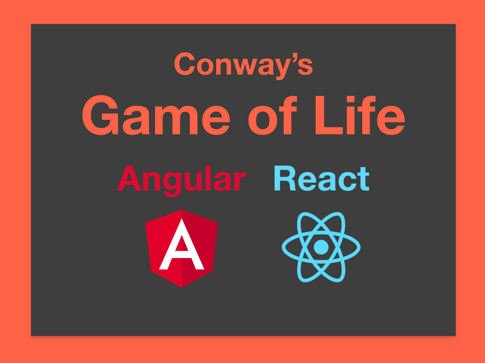
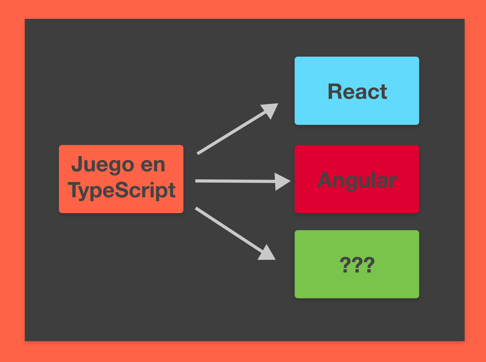
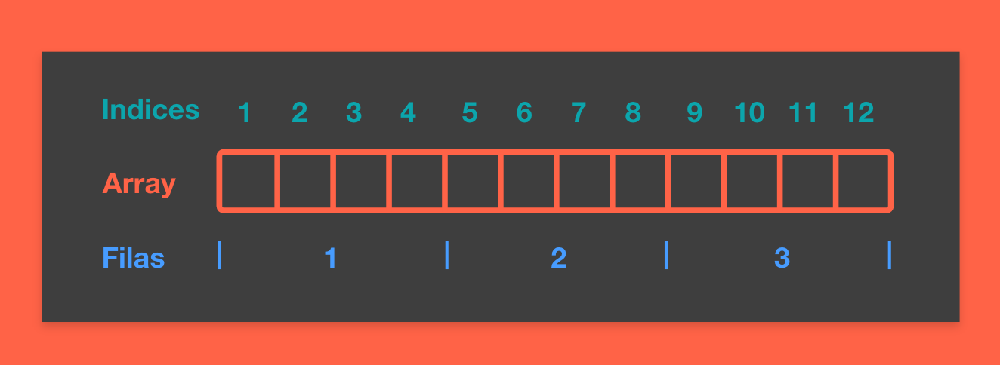

# ‘Conway’s Game of Life’ en Angular y React

Implementando el ‘Juego de la Vida’ con Angular y React.



## ¿Cuáles son las reglas del juego?

El juego consiste en una cuadrícula de células.
Cada célula tiene 8 vecinos, en el lateral, vertical y diagonales.

Las células siguen ciertas normas:

Si la célula está viva:

- Si tiene menos de dos vecinos vivos -> Muere
- Si tiene dos o tres vecinos vivos -> Vive
- Si son más de tres vecinos vivos -> Muere

Si la célula está muerta:

- Si tiene tres vecinos vivos -> Vive

Estas sencillas reglas, en combinación, pueden crear mécanicas muy complejas.


## Análisis

He decidido separar la lógica del juego de la lógica de presentación.
Esto permite reutilizar el código del juego en Angular y React.



## Implementación en TypeScript

En esta implentación se almacenan las células en un array de una dimensión.
Con la ventaja de que es una forma más sencilla de guardar los datos.
Y con la desventaja es que habrá que “simular” la bidimensionalidad.



```typescript
// Una célula tiene dos posibles estados, viva o muerta.
export enum Cell {
  Alive,
  Dead,
}

// El estado del mundo es un array plano de células.
export type State = Cell[];

type Dimensions = { width: number; height: number };

export class GameOfLife {
  public dimensions: Dimensions;
  public state: State;

  private constructor(state: State, dimensions: Dimensions) {
    this.state = state;
    this.dimensions = dimensions;
  }

  // Esta función se encarga de generar un juego con la anchura, altura y estado inicial.
  public static new(width: number, height: number, initial: State): GameOfLife {
    // Si el estado inicial no coincide con la anchura y altura, se lanza un error.
    if (initial.length < width * height) {
      throw new Error("Invalid initial State");
    }

    return new GameOfLife(initial, { width, height });
  }

  // Esta función ejecuta las normas del juego y actualiza el estado.
  public tick(): void {
    // El nuevo estado.
    let newState = this.state.map((cell, index) => {
      const aliveNeighbors = this.aliveNeighborCount(index);

      // Si la célula está viva.
      if (cell === Cell.Alive) {
        // Si tiene menos de dos vecinos vivos, muere.
        if (aliveNeighbors < 2) return Cell.Dead;
        // Si tiene dos o tres vecinos vivos, vive.
        if (aliveNeighbors === 2 || aliveNeighbors === 3) return Cell.Alive;
        // Si tiene más de tres vecinos, muere.
        if (aliveNeighbors > 3) return Cell.Dead;
        // Si la célula está muerta.
      } else if (cell === Cell.Dead) {
        // Si tiene tres vecinos vivos, vive.
        if (aliveNeighbors === 3) return Cell.Alive;
      }

      return cell;
    });

    this.state = newState;
  }

  // Devuelve la cantidad de vecinos vivos de una célula.
  private aliveNeighborCount(index: number): number {
    const row = Math.floor(index / this.dimensions.width);
    const column = index - row * this.dimensions.width;
    let count = 0;

    // Se comprueba una matrix 3x3 alrededor de la célula.
    // (-1,-1) (0,-1) (1,-1)
    // (-1, 0) (0, 0) (1, 0)
    // (-1, 1) (0, 1) (1, 1)
    for (let deltaRow of [this.dimensions.height - 1, 0, 1]) {
      for (let deltaCol of [this.dimensions.width - 1, 0, 1]) {
        // Se descarta la célula en cuestión (0, 0).
        if (deltaRow === 0 && deltaCol === 0) {
          continue;
        }

        // Al usar el operador módulo, evitamos errores en los casos de los extremos.
        const neighborRow = (row + deltaRow) % this.dimensions.height;
        const neighborColumn = (column + deltaCol) % this.dimensions.width;
        const neighborIndex =
          neighborRow * this.dimensions.width + neighborColumn;

        count += this.state[neighborIndex] === Cell.Alive ? 1 : 0;
      }
    }

    return count;
  }
}
```

## Probando la implementación

Para probar que el juego funciona he creado un par de funciones de parseo que harán que el código sea más fácil de escribir y de leer.

```typescript
import { State, Cell, GameOfLife } from "./GameOfLife";

// Esta función transforma un array de string a un estado válido.
export function stringToGameState(...string: String[]): State {
  return string
    .join("")
    .split("")
    .map((value) => (value === "*" ? Cell.Alive : Cell.Dead));
}

// Esta función transforma un juego en un array de string.
export function gameToString(game: GameOfLife): String[] {
  return chunkArray([...game.state], game.dimensions.width).map((row) =>
    row.map((cell) => (cell === Cell.Alive ? "*" : "·")).join("")
  );
}

// Divide un array en varios según el parámetro.
function chunkArray<T>(array: T[], size: number): T[][] {
  const result = [];

  while (array.length) {
    result.push(array.splice(0, size));
  }

  return result;
}
```

Este código es compatible con Jest en React y Jasmine en Angular.

```typescript
import { GameOfLife } from "./GameOfLife";
import { stringToGameState, gameToString } from "./GameOfLifeParser";

describe("GameOfLife", () => {
  // Estos objetos mantienen su forma.
  describe("Still Lifes", () => {
    test("Block", () => {
      const block = ["····", "·**·", "·**·", "····"];

      const game = GameOfLife.new(4, 4, stringToGameState(...block));
      game.tick();

      expect(gameToString(game)).toEqual(block);
    });

    test("Bee-hive", () => {
      const beeHive = ["······", "··**··", "·*··*·", "··**··", "······"];

      const game = GameOfLife.new(6, 5, stringToGameState(...beeHive));
      game.tick();

      expect(gameToString(game)).toEqual(beeHive);
    });

    test("Loaf", () => {
      const loaf = ["······", "··**··", "·*··*·", "··**··", "······"];

      const game = GameOfLife.new(6, 5, stringToGameState(...loaf));
      game.tick();

      expect(gameToString(game)).toEqual(loaf);
    });

    test("Boat", () => {
      const boat = ["·····", "·**··", "·*·*·", "··*··", "·····"];

      const game = GameOfLife.new(5, 5, stringToGameState(...boat));
      game.tick();

      expect(gameToString(game)).toEqual(boat);
    });

    test("Tub", () => {
      const tub = ["·····", "··*··", "·*·*·", "··*··", "·····"];

      const game = GameOfLife.new(5, 5, stringToGameState(...tub));
      game.tick();

      expect(gameToString(game)).toEqual(tub);
    });
  });

  // Estos objetos oscilan su forma.
  describe("Oscilators", () => {
    test("Blinker", () => {
      const blinker = ["·····", "·····", "·***·", "·····", "·····"];

      const game = GameOfLife.new(5, 5, stringToGameState(...blinker));
      game.tick();

      expect(gameToString(game)).toEqual([
        "·····",
        "··*··",
        "··*··",
        "··*··",
        "·····",
      ]);
    });

    test("Toad", () => {
      const toad = ["······", "······", "··***·", "·***··", "······", "······"];

      const game = GameOfLife.new(6, 6, stringToGameState(...toad));
      game.tick();

      expect(gameToString(game)).toEqual([
        "······",
        "···*··",
        "·*··*·",
        "·*··*·",
        "··*···",
        "······",
      ]);
    });

    test("Beacon", () => {
      const toad = ["······", "·**···", "·*····", "····*·", "···**·", "······"];

      const game = GameOfLife.new(6, 6, stringToGameState(...toad));
      game.tick();

      expect(gameToString(game)).toEqual([
        "······",
        "·**···",
        "·**···",
        "···**·",
        "···**·",
        "······",
      ]);
    });
  });

  // Estos objetos se mueven en el mundo.
  describe("Spaceships", () => {
    test("Glider", () => {
      const toad = [
        "··········",
        "·····*····",
        "···*·*····",
        "····**····",
        "··········",
      ];

      const game = GameOfLife.new(10, 5, stringToGameState(...toad));

      game.tick();
      expect(gameToString(game)).toEqual([
        "··········",
        "····*·····",
        "·····**···",
        "····**····",
        "··········",
      ]);

      game.tick();
      expect(gameToString(game)).toEqual([
        "··········",
        "·····*····",
        "······*···",
        "····***···",
        "··········",
      ]);

      game.tick();
      expect(gameToString(game)).toEqual([
        "··········",
        "··········",
        "····*·*···",
        "·····**···",
        "·····*····",
      ]);
    });
  });
});
```

## Conexión con React

La implementación en React utiliza un componente funcional y hooks de estado.

```typescript
import React, { useState, CSSProperties, useEffect } from "react";
import { Cell } from "../../game-of-life/GameOfLife";
import { GameExamples } from "../../game-of-life/GameExamples";
import "./SimpleGameOfLife.css";

export const SimpleGameOfLife: React.FC = () => {
  // Los ejemplos disponibles en la demo.
  const examples = {
    Block: GameExamples.block(),
    "Bee Hive": GameExamples.beeHive(),
    Loaf: GameExamples.loaf(),
    Blinker: GameExamples.blinker(),
    Toad: GameExamples.toad(),
    Beacon: GameExamples.beacon(),
    Glider: GameExamples.glider(),
  };

  // El ejemplo seleccionado, por defecto block.
  const [example, setExample] = useState(examples.Block);
  // El juego actual, con el ejemplo seleccionado como estado inicial.
  const [game, setGame] = useState(example);
  // Las células actuales.
  const [cells, setCells] = useState(game.state);

  // Cuando se seleccione un ejemplo, se actualizará el juego con ese ejemplo.
  const onExampleSelected = (event: React.ChangeEvent<HTMLSelectElement>) => {
    const key = event.target.value as keyof typeof examples;
    setExample(examples[key]);
  };

  // Este efecto se encarga de actualizar el estado el juego cada 200 milisegundos.
  useEffect(() => {
    const interval = setInterval(() => {
      game.tick();
      setCells(game.state);
    }, 200);

    return () => clearInterval(interval);
  }, [setCells, game]);

  // Este ejemplo se encarga de actualizar el juego con el ejemplo seleccionado.
  useEffect(() => {
    setGame(example);
  }, [example, setGame]);

  // Se utiliza el ancho de las dimensiones del juego como columnas para el grid de CSS.
  const style: CSSProperties = {
    gridTemplateColumns: `repeat(${game.dimensions.width}, auto)`,
  };

  return (
    <section>
      <label className="example">
        Example
        <select onChange={onExampleSelected}>
          {Object.keys(examples).map((key) => (
            <option value={key} key={key}>
              {key}
            </option>
          ))}
        </select>
      </label>
      <div className="world" style={style}>
        {cells.map((cell, index) => {
          return (
            <div
              className={`cell ${cell === Cell.Alive ? "alive" : "dead"}`}
              key={index}
            ></div>
          );
        })}
      </div>
    </section>
  );
};
```

## Conexión con Angular

```html
<section>
  <label className="example">
    Example
    <select [(ngModel)]="selected" (change)="onExampleChange()">
      <option *ngFor="let example of examples | keyvalue" [value]="example.key"
        >{{ example.key }}</option
      >
    </select>
  </label>
  <div class="world" [ngStyle]="getWorldStyle()">
    <div *ngFor="let cell of game.state" [ngClass]="getCellClass(cell)"></div>
  </div>
</section>
```

```typescript
import { Component } from "@angular/core";
import { interval, Subscription } from "rxjs";
import { GameExamples } from "src/app/game-of-life/GameExamples";
import { Cell } from "src/app/game-of-life/GameOfLife";

@Component({
  selector: "app-simple-game-of-life",
  templateUrl: "./simple-game-of-life.component.html",
  styleUrls: ["./simple-game-of-life.component.css"],
})
export class SimpleGameOfLifeComponent {
  subscription: Subscription;
  // Los ejemplos disponibles en la demo.
  examples = {
    Block: GameExamples.block(),
    "Bee Hive": GameExamples.beeHive(),
    Loaf: GameExamples.loaf(),
    Blinker: GameExamples.blinker(),
    Toad: GameExamples.toad(),
    Beacon: GameExamples.beacon(),
    Glider: GameExamples.glider(),
  };
  // El ejemplo seleccionado.
  selected = "Block";
  // El juego actual.
  game = this.examples[this.selected];

  ngOnInit() {
    // Se va a actualizar el juego cada 200 milisegundos.
    this.subscription = interval(200).subscribe((_) => this.game.tick());
  }

  ngOnDestroy() {
    this.subscription.unsubscribe();
  }

  onExampleChange() {
    // Cuando se seleccione un ejemplo, se actualizará el juego con ese ejemplo.
    this.game = this.examples[this.selected];
  }

  getWorldStyle() {
    return {
      gridTemplateColumns: `repeat(${this.game.dimensions.width}, auto)`,
    };
  }

  getCellClass(cell: Cell) {
    return {
      cell: true,
      dead: cell === Cell.Dead,
      alive: cell === Cell.Alive,
    };
  }
}
```
